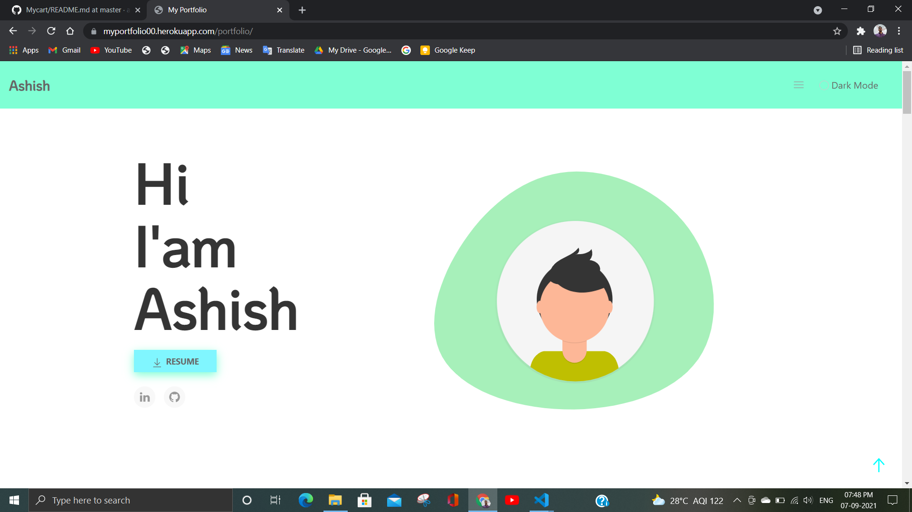

# Myportfolio
# Information
This is my Portfolio website. I am create this website for show my skill of improve contect with IT company for job purpose.

funtionality of this product:-

 * **Send link my Resume:** Visiter Enter Email Id where who recive my Resume.
 * **Contact** Visiter contact with me using phone number,Email,or send message.

 * **About** Visiter Learn About me.
 * **Show my Project** Visiter can also show my Project.
 * **Show My Certificate** Visiter can also show my Certificate.
 * **Education** Visiter can Know about my Education.


# Screenshot


# Files/foder in onlineshop app

  * **Settings:** This is the main file of django app. This is contain configuration system like all install app , database, middleware,templates etc.
  * **models:** This is contain blueprint of all database table in python class.This is contain send,contect,resume,project,certificate models. 
  * **urls:** This is contain urls. In this project two urls file root urls or in side shop app urls. Ecah url map with specefic method.
  * **views:** This is contain action of method that are contain urls file.
  * **admin:** Django provide default admin page so it is required to register this models inside admin file or also provide features to filter,search, show coloum ect.
  * __init__: It is describe it is a python package.
  * **Pycache:** This is contain byte code after complitation of python code.
  * **migration folder:** This is contain blueprint of table in code formate after migrate command it is apply on actual database table.

  * **template:** This is contain html page like userlogin, dashbord, payment, odderpdf, filter, index, search, showcart, newaccount, varification, zoom etc.
  * **manage:** Django's command-line utility for administrative tasks. runserver, makemigration, migrate, createsuperuser etc.      

# Features of My Portfolio Website
  * Send Resume Link.
  * Contect with me.
  * Show My Project.
  * Show my Education
  * Show My Certificate
  * Beautifull and effictive User Interface


# Deploy  
I use heroku free host website paltform for testing purpose. I use postgress object oriented database system.
  * downlaod heroku CLI
  * add import django_heroku in setting file.
  * DEBUG =False.
  * ALLOWED_HOSTS = ["app url"]

I use some command:-
 ```
 myenv\scripts\activate.bat
 pip install gunicorn
 pip freeze > requirement.txt
 git init
 git add .
 git commit -m '-------'
 heroku login
 git:remote -a 'name of heroku app'
 git push heroku master
 heroku run bash
 python manage.py makemigrations
 python manage.py migrate
 python manage.py runserver 
 ```

 # Visit My Portfolio
 My onlinecartshop is host on heroku server. you can visit click on this link :
 [My Portfolio](https://myportfolio33.herokuapp.com/portfolio)
